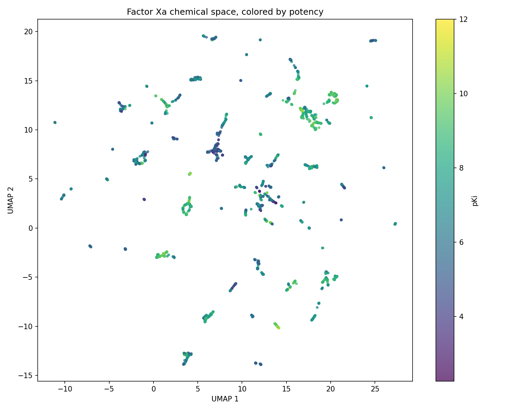
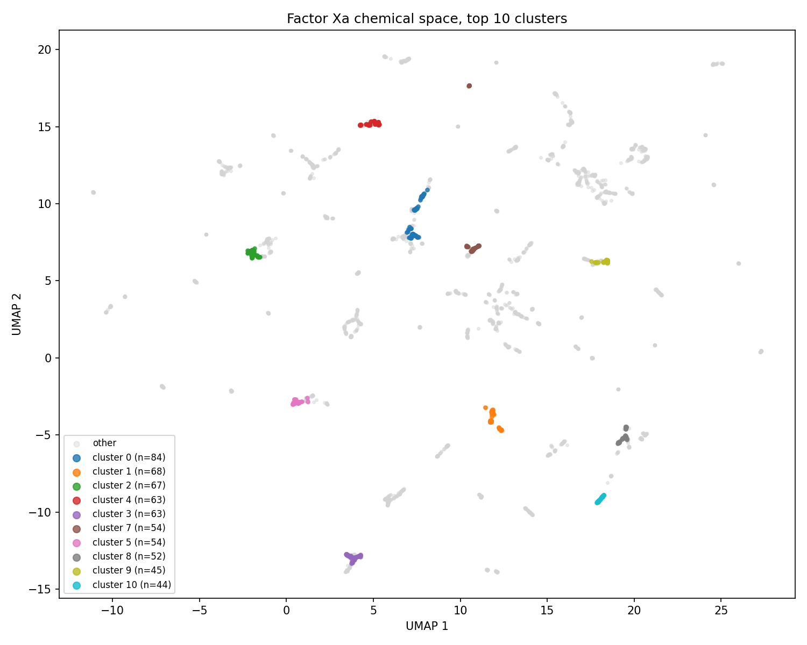
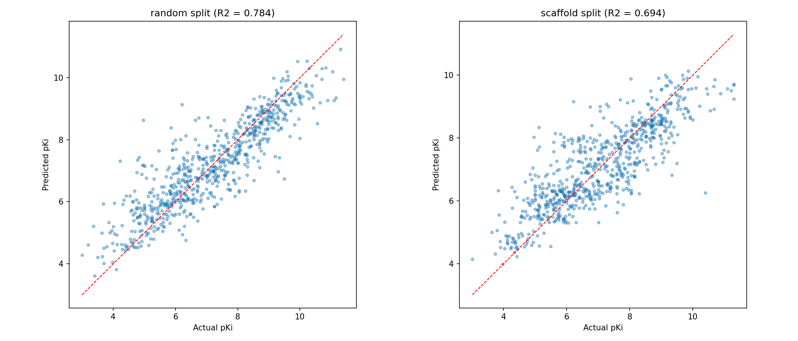

# Factor Xa Cheminformatics and QSAR

A hands on cheminformatics pipeline built on real bioactivity data for Factor Xa inhibitors, taking ~3,500 standardized compounds from raw ChEMBL records through clustering, chemical space visualization, scaffold analysis, and a validated machine learning model that predicts potency from molecular structure and reports its own confidence.

This is a self directed learning project (pharmaceutical chemistry plus machine learning), built notebook by notebook. The emphasis throughout is on doing the cheminformatics correctly rather than chasing an impressive number, which is why the most important result here is a deliberately *honest* model evaluation rather than the highest possible score.

## The dataset

Bioactivity data for Factor Xa was pulled live from ChEMBL via the web resource client, then cleaned through sequential filters: nanomolar units only, exact (equality) activity relations only, deduplication, and SMILES validation. Inhibition constants were converted to pKi. Every compound was then standardized with RDKit (cleanup, fragment parent extraction, charge neutralization, tautomer canonicalization) so that salts, charged forms, and tautomers of the same molecule collapse to one consistent representation.

Final working set: roughly 3,477 standardized, deduplicated Factor Xa inhibitors with measured pKi values.

## Pipeline

The work is organized as one notebook per step.

**Week 1, foundations.** RDKit basics, molecular descriptors and Lipinski analysis (about 19 percent of the set violates at least one Rule of Five criterion), SMARTS substructure matching, Morgan fingerprints, Tanimoto similarity, the ChEMBL data pull, and full standardization.

**Week 2, analysis and modeling.**

1. **Butina clustering** on Tanimoto distance (0.65 similarity threshold) to find the distinct chemical series in the data.
2. **UMAP projection** of the 2048 bit Morgan fingerprints into two dimensions using Jaccard distance, colored by cluster and by potency.
3. **Murcko scaffold analysis** to decompose every compound into its core ring system and quantify structural diversity.
4. **Train and test splitting strategies**, comparing random, scaffold based, and cluster based splits to measure data leakage.
5. **Random Forest QSAR model** predicting pKi from fingerprints, evaluated honestly across all three splits.
6. **Inference notebook** that predicts potency for any input SMILES and flags whether the prediction is trustworthy.

## Key results

### Chemical space

The UMAP projection shows the compounds occupy several spatially coherent regions rather than one undifferentiated blob, and potency is not uniformly distributed across that space.





### Scaffold diversity

Murcko decomposition yields a scaffold diversity ratio of **0.412** (1,434 unique scaffolds across 3,477 compounds). This sits in the healthy middle: the data is neither a single series rediscovered thousands of times nor a sparse scatter of one off structures. It reflects a genuinely explored chemotype with real structure activity relationships to learn from.

### The leakage problem, made visible

This is the central methodological result. A naive random train and test split looks fine on the surface, but **55.5 percent** of the scaffolds in the random test set also appear in training. More than half the "test" compounds are therefore close analogs of something the model already saw, so a random split measures memorization, not generalization.

Splitting so that whole scaffolds (or whole similarity clusters) stay entirely within either training or test fixes this and gives an honest estimate of how the model performs on genuinely new chemistry. The same Random Forest, the same features, evaluated three ways:

| Split | R squared | MAE (pKi) | RMSE (pKi) |
|---|---|---|---|
| Random (leaky) | 0.784 | 0.596 | 0.800 |
| Scaffold | 0.694 | 0.685 | 0.891 |
| Cluster (strictest) | 0.607 | 0.786 | 1.026 |

Every metric degrades monotonically as the split gets chemically stricter, exactly as it should. The random split overstates R squared by close to 0.18 relative to the strictest honest split, and average error grows from 0.80 to 1.03 log units. The model still has real predictive signal on unseen chemistry (the cluster split comfortably beats a mean baseline), it is simply weaker than a leaky split would advertise.



### Inference with an applicability domain

The model is only trustworthy on chemistry resembling its training set, so the inference function does not just return a number. It also computes the maximum Tanimoto similarity of the query to any training compound and labels the prediction high, moderate, or low confidence accordingly.

A worked example on three inputs:

| Input | Predicted pKi | Max similarity to training | Confidence |
|---|---|---|---|
| Known inhibitor from the dataset | 8.90 | 1.000 | high |
| Novel designed analog | 7.37 | 0.427 | moderate |
| Caffeine (unrelated) | 6.56 | 0.171 | low (out of domain) |

The novel analog is the meaningful case: a structure never seen in training receives a plausible potency estimate plus an honest moderate confidence flag, because its nearest training neighbor is only 0.43 similar. Note also that caffeine still gets a numeric prediction of 6.56, but the low similarity score (0.171) correctly flags it as out of domain and not to be trusted. This applicability domain check is what separates a model that knows what it knows from one that confidently predicts nonsense.

## Repository structure

```
factor_xa_cheminformatics/
  README.md
  notebooks/
    week1_*.ipynb
    week2_day1_butina_clustering.ipynb
    week2_day2_umap_projection.ipynb
    week2_day3_murcko_scaffolds.ipynb
    week2_day4_splitting.ipynb
    week2_day5_random_forest_qsar.ipynb
    inference.ipynb
  figures/
  data/
    factor_xa_standardized.csv
```

## Running it

Everything runs in Google Colab with no local setup. Each notebook installs its own dependencies in the first cell. To try the model on your own compound, open `inference.ipynb`, run the cells top to bottom, and call `predict_pki("YOUR_SMILES_HERE")`.

## Tech stack

RDKit, scikit-learn, UMAP, pandas, NumPy, matplotlib, and the ChEMBL web resource client.

## Roadmap

This repository covers the foundational cheminformatics and a first QSAR model. Planned next stages move toward structural biology and structure based methods: parsing protein structures, predicted structures, and molecular docking, building toward a complete computational pipeline from bioactivity data to structure informed predictions.
